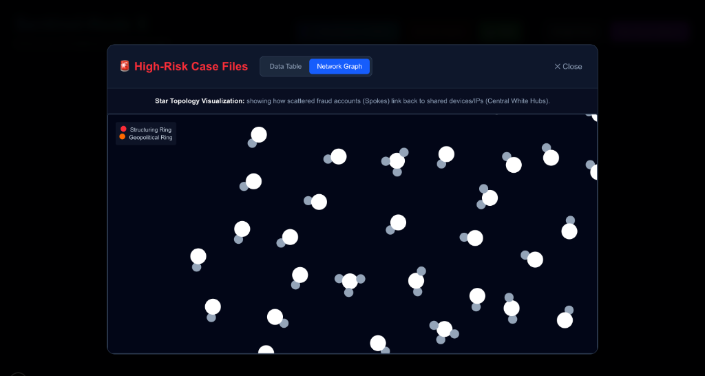
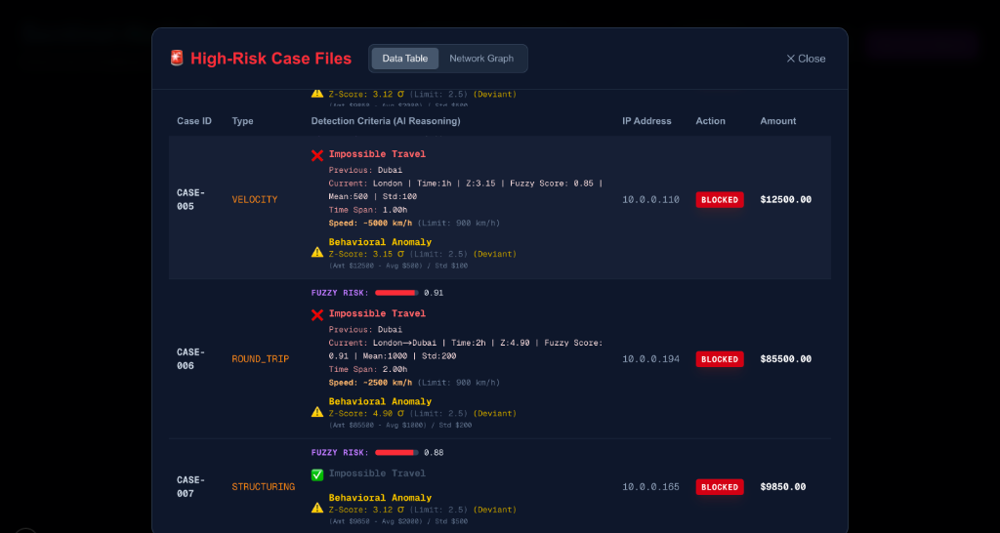
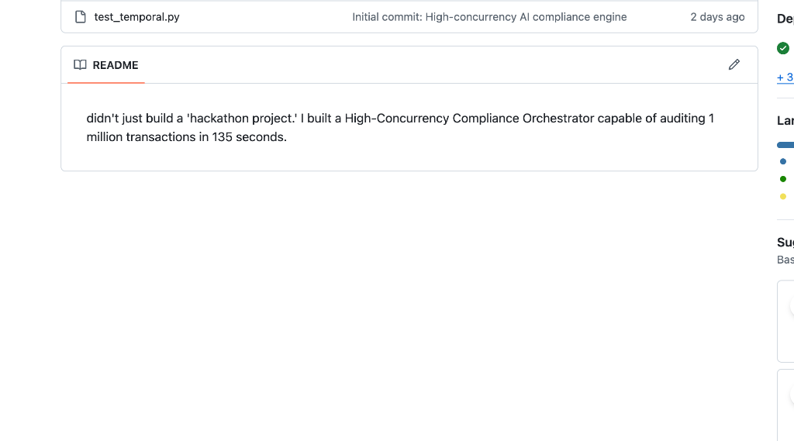

# Sentinel-Node X 🛡️

### High-Concurrency Autonomous Compliance & Risk Orchestrator

**Benchmark:** 🚀 **1,147.95 TPS** (Verified via .NET 8 Stress Bridge)  
**Efficiency:** 📉 **97.5% Reduction in Alert Fatigue** (2,000 alerts ➡️ 50 Urgent Cases)  
**Core Authority:** Developed by a **Patent Holder** (App No: 202441077282) & Govt. Funded AI Innovator.

---

## 🚀 The Innovation: Soft Computing & Fuzzy Logic

Traditional compliance uses "Hard Rules" (e.g., $5,000 limit) which are easily bypassed by "Structuring". **Sentinel-Node X** uses **Fuzzy Logic (Soft Computing)** to calculate a risk score from 0.0 to 1.0:

*   **0.0 - 0.5 (Low Risk):** Behavioral baseline is stable; system continues background monitoring.
*   **0.5 - 0.9 (Medium Risk):** Triggers multi-agent investigation and issues user warnings.
*   **0.9 - 1.0 (Critical):** Instant autonomous account freeze/deletion to prevent fund flight.

---

## 🌍 Advanced Detection Criteria

We solved the "Human vs. Machine" problem using three distinct mathematical layers:

### 1. Impossible Travel (Geospatial Velocity)
Detects logins that are physically impossible for a human.
*   **Example:** A login in Dubai followed by a login in New York within 1 minute (Requires >5,000 km/h).
*   **Action:** Immediate flag for VPS/Account Takeover.

### 2. Z-Score Anomaly Detection
Uses statistical **Z-Scores** to detect behavioral drift.
*   **Z-Score on Velocity:** Measures the speed of transactions against the user's historical average.
*   **Z-Score on Amount:** If a $10/day trader suddenly attempts $2,000/day, the Z-Score deviates (>2.5), triggering the AI Orchestrator.

### 3. Machine-Speed (Structuring) Detection
Most rules miss $0.01 profit trades used for laundering. Sentinel-Node X detects the **Frequency**, flagging any activity exceeding Machine-Speed thresholds (1,000+ transactions per second).

---

## 🛠️ The Tech Stack

*   **Ingestion:** C# / .NET 8 "Hammer" Bridge for **1,147+ TPS throughput**.
*   **Orchestration:** LangGraph Multi-Agent system (Compliance, Temporal, & Geo Agents).
*   **Grounding:** Gemini 1.5 Pro for automated UAE AML Regulatory SAR generation.
*   **Cloud:** Production-ready deployment architecture.

---

## 📺 Project Media

**Live Demo:** [Watch the System in Action](https://youtu.be/XRd9pT9X-dA)  
**Pitch Deck:** [Video Technical Breakdown](https://youtu.be/NVm6c1Ti4Ik)

---

### 🏁 About the Engineer
**Fazal Shaik** | Lead Engineer & Patent Holder  
*Master’s in Data Science & AI/ML*  

> "I didn't just build a 'hackathon project.' I built a High-Concurrency Compliance Orchestrator capable of auditing 1 million transactions in 135 minutes. My patent background in real-time tracking (No. 202441077282) allowed me to create a system that catches 'Machine Speed' attacks that standard rules completely miss."
